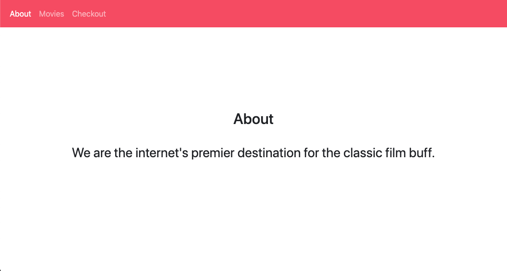

<div align="center" id="top">
     
</div>
# <h1 align="center">Routing</h1>

<p align="center">
  <a href="#dart-description">Description</a> &#xa0; | &#xa0; 
  <a href="#dart-demo">Demo</a> &#xa0; | &#xa0;
  <a href="#memo-improvements">Improvements</a> &#xa0; | &#xa0;
  <a href="#art-technologies">Technologies</a> &#xa0; | &#xa0;
  <a href="#white_check_mark-requirements">Requirements</a> &#xa0; | &#xa0;
  <a href="#toolbox-installation">Installation</a> &#xa0; | &#xa0;
  <a href="#joystickhow-to-play">How to Play</a> &#xa0; | &#xa0;
  <a href="#briefcase-license">License</a> &#xa0; | &#xa0;
  <a href="https://github.com/arturomsoberanes" target="_blank">Author</a>
</p>

<br>


## :dart: Description ##

Routing is a project from week 17 of the MITXPRO "Full-Stack with MERN" certification, we create a navigation bar using Bootstrap and add routing to allow navigation between different pages.

## :dart: DEMO ##

If you want to try it just click [here](https://arturomsoberanes.github.io/routing)

## :memo: Improvements ##

These are the list of currect improvements:

- :diamonds: Add more pages.	
- :diamonds: Improve routing.js .	

## :art: Technologies ##

- [HTML](https://www.w3schools.com/html/)
- [CSS](https://www.w3schools.com/css/)
- [JavaScript](https://www.w3schools.com/js/)

## :white_check_mark: Requirements ##

Before starting :checkered_flag:, you need to have:
- [Git](https://git-scm.com).
- [Node.js](https://nodejs.og/en/).

## :toolbox: Installation ##

Clone Repository

```bash
$ git clone https://github.com/arturomsoberanes/routing.git
```

## :joystick:	How to Run ##

Access in directory

```bash
$ cd routing
```

Execute a Local Server, you can do:

```bash
$ npx http-server
```


## :briefcase:	 License ##

This project is under license from MIT. For more details, see the [LICENSE](LICENSE) file.


Made with :heart: by <a href="https://github.com/arturomsoberanes" target="_blank">Arturo Soberanes</a>

&#xa0;

<a href="#top">Back to top</a>

